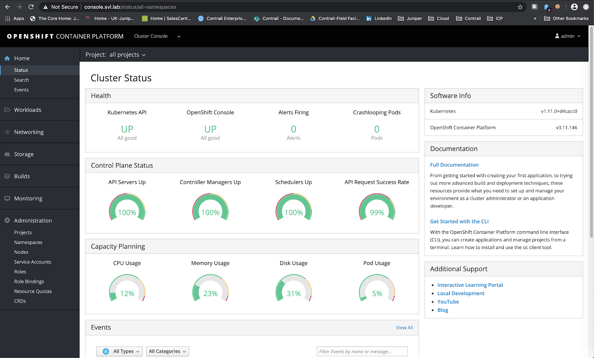
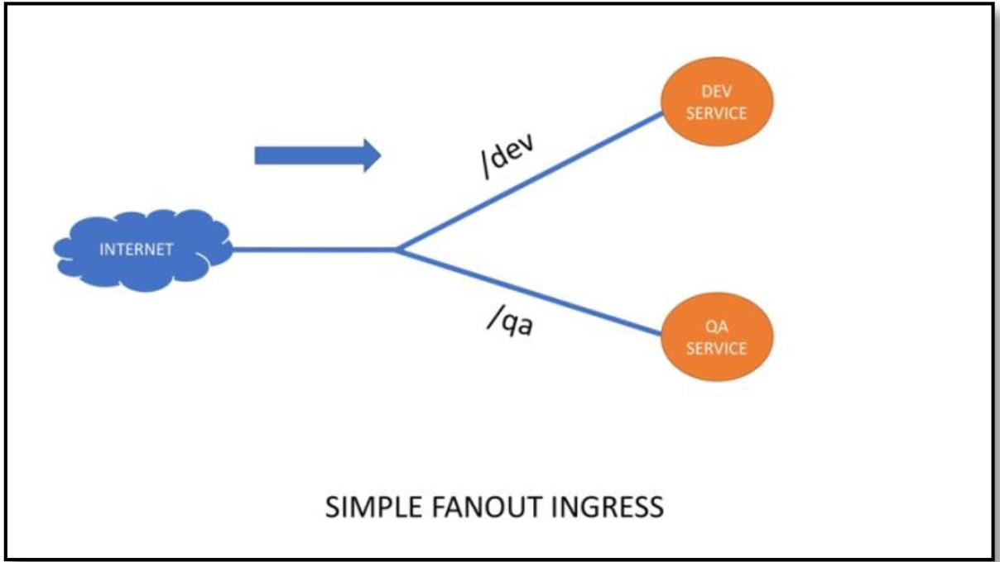

# Introduction

This ready architecture guide describes the infrastructure necessary for deployment and operation of the application deployment platform, providing the information that you need to facilitate readiness for both initial and ongoing operations. Topics include the architectural requirements that you must meet to successfully deploy:


1. **Red Hat OpenShift Container Platform v3.11** - An enterprise Kubernetes-based container application deployment platform
2. **Red Hat OpenShift Container Storage** - Software-defined storage that is integrated with and optimized for Red Hat OpenShift Container Platform and that runs anywhere OpenShift runs
3. **Juniper Contrail Networking** - provides dynamic end-to-end networking policy and control and orchestrates virtual overlay workload connectivity

The reference architecture includes details of server/VM configurations and deployment scenarios for:


*   **Small Cluster.** With three nodes, this configuration is appropriate for proofs of concept (PoC)
*   **Medium Cluster.** With six nodes, this configuration is suitable for small production environments
*   **Large Cluster.** With 15 nodes, this configuration is designed for high-availability production environments.
*   **Public Cloud**. Deployment of OpenShift 3.11 with Contrail 2003 in AWS.

The OpenShift deployment and operation validation using test use cases.


# Hardware and Software Infrastructure

The servers used for bastion, controller nodes and compute nodes and storage nodes have different requirements regarding number of cores, memory, disk and networking.

The following tables shows the recommended configurations for the deployment scenarios covered:


## Small cluster

This architecture is designed for PoC and development environments. Three nodes comprise the cluster. For this variant the cluster can be installed in non-HA or HA.

For non-HA we will need a 1 x Bastion, 1 x Contrail Command, 1 x Master, Infra and 3 x Computes.


For a HA cluster, we will need a 1 x Bastion,  1 x Contrail Command, 1 x Load Balancer, 3 x Masters, 3 x Infra and 3 Computes


### The recommended system requirements


<table>
  <tr>
   <td><strong>Hardware Requirements</strong>
   </td>
   <td><strong>Bastion/Command/Load Balancer</strong>
   </td>
   <td><strong>Master Nodes</strong>
   </td>
   <td><strong>Infra Nodes</strong>
   </td>
   <td><strong>Compute Nodes</strong>
   </td>
  </tr>
  <tr>
   <td>CPU/RAM
   </td>
   <td>4 vCPU, 16GB RAM
   </td>
   <td>8 vCPU, 16GB RAM
   </td>
   <td>16 vCPU, 64GB RAM
   </td>
   <td>As per <a href="https://docs.openshift.com/container-platform/3.11/install/prerequisites.html">OpenShift</a> recommendations.
   </td>
  </tr>
  <tr>
   <td>Disk
   </td>
   <td>100 GB - Host OS
   </td>
   <td>100 GB - Host OS
   </td>
   <td>250 GB - Host OS
   </td>
   <td>100 GB – Host OS
<p>
250 GB – OpenShift Container Storage (Application) - No partition needs to be created
   </td>
  </tr>
  <tr>
   <td>Network Interface
   </td>
   <td>1 x 1Gbps or 1 x 10Gbps
   </td>
   <td>1 x 1Gbps or 1 x 10Gbps
   </td>
   <td>1 x 1Gbps or 1 x 10Gbps
   </td>
   <td>1 x 1Gbps or 1 x 10Gbps
   </td>
  </tr>
</table>


### Software components

**Red Hat Enterprise Linux (RHEL)**

**Red Hat OpenShift Contrail Platform (OCP)**

**Red Hat OpenShift Container Storage.** Red Hat OpenShift Container Storage can be configured to provide persistent storage and dynamic provisioning for OpenShift Container Platform. Gluster storage can be containerized within OpenShift Container Platform (converged mode) or non-containerized on its own nodes (independent mode). For a small cluster [independent mode](https://docs.openshift.com/container-platform/3.11/install_config/persistent_storage/persistent_storage_glusterfs.html#install-example-basic-external) can be choosed. In this case the registry will run on NFS and Application volumes on GlusterFS. This is what we will use in our demo.

**Juniper Contrail Networking**. The solution uses Juniper Contrail Networking as Container Network Interface (CNI) and for overlay networking.


## Medium cluster

This architecture is designed for small production environments. It consists of six nodes - three hyperconverged nodes and three application nodes. Three OpenShift Application (compute) nodes are physical machines without a VM-hypervisor.


### The recommended system requirements


<table>
  <tr>
   <td><strong>Hardware Requirements</strong>
   </td>
   <td><strong>Bastion/Command/Load Balancer</strong>
   </td>
   <td><strong>Master Node</strong>
   </td>
   <td><strong>Infra Node</strong>
   </td>
   <td><strong>Compute Nodes</strong>
   </td>
  </tr>
  <tr>
   <td>CPU/RAM
   </td>
   <td>4 vCPU, 16GB RAM
   </td>
   <td>8 vCPU, 16GB RAM
   </td>
   <td>16 vCPU, 64GB RAM
   </td>
   <td>28 (2x14) cores, 256GB RAM
   </td>
  </tr>
  <tr>
   <td>Disk
   </td>
   <td>100 GB
   </td>
   <td>2 x 250 GB RAID - Host OS
   </td>
   <td>2 x 500 GB RAID – Host OS
<p>
1 x 1TB - OpenShift Container Storage (Registry)
   </td>
   <td>2 x 500 GB RAID – Host OS
<p>
1 x 4 TB – OpenShift Container Storage (Application) - No partition needs to be created
   </td>
  </tr>
  <tr>
   <td>Network Interface
   </td>
   <td>1 x 10Gbps
   </td>
   <td>1 x 10Gbps
   </td>
   <td>1 x 10Gbps
   </td>
   <td>1 x 25Gbps
   </td>
  </tr>
</table>


### Software components

**Red Hat Enterprise Linux (RHEL)**

**Red Hat OpenShift Contrail Platform (OCP)**

**Red Hat OpenShift Container Storage** Based on Red Hat Gluster storage, Red Hat OpenShift Container Storage provides high-performance, persistent storage for container environments with granular control over every component of the storage landscape. Through integration with Red Hat OpenShift Container Platform, Red Hat OpenShift Container Storage stores application data as well as the container registry, logs, and metrics. This is called [converged mode](https://docs.openshift.com/container-platform/3.11/install_config/persistent_storage/persistent_storage_glusterfs.html#install-example-registry).

**Juniper Contrail Networking**. The solution uses Juniper Contrail Networking as Container Network Interface (CNI) and for overlay networking.


## Large cluster

This architecture is suitable for high-availability production environments. It consists of 15 nodes—three hyperconverged infrastructure nodes and 12 application nodes. The architecture is the same like a medium cluster with an increased Application Nodes to 12 bare metal servers.


### The recommended system requirements


<table>
  <tr>
   <td><strong>Hardware Requirements</strong>
   </td>
   <td><strong>Bastion/Command/Load Balancer</strong>
   </td>
   <td><strong>Master Node</strong>
   </td>
   <td><strong>Infra Node</strong>
   </td>
   <td><strong>Compute Nodes</strong>
   </td>
  </tr>
  <tr>
   <td>CPU/RAM
   </td>
   <td>4 vCPU, 16GB RAM
   </td>
   <td>8 vCPU, 16GB RAM
   </td>
   <td>16 vCPU, 64GB RAM
   </td>
   <td>28 (2x14) cores, 256GB RAM
   </td>
  </tr>
  <tr>
   <td>Disk
   </td>
   <td>100 GB
   </td>
   <td>2 x 250 GB RAID - Host OS
   </td>
   <td>2 x 500 GB RAID – Host OS
<p>
1 x 1TB - OpenShift Container Storage (Registry)
   </td>
   <td>2 x 500 GB RAID – Host OS
<p>
1 x 4 TB – OpenShift Container Storage (Application) - No partition needs to be created
   </td>
  </tr>
  <tr>
   <td>Network Interface
   </td>
   <td>1 x 10Gbps
   </td>
   <td>1 x 10Gbps
   </td>
   <td>1 x 10Gbps
   </td>
   <td>1 x 25Gbps
   </td>
  </tr>
</table>


### Software components

**Red Hat Enterprise Linux (RHEL)**

**Red Hat OpenShift Contrail Platform (OCP)**

**Red Hat OpenShift Container Storage. **Based on Red Hat Gluster storage, Red Hat OpenShift Container Storage provides high-performance, persistent storage for container environments with granular control over every component of the storage landscape. Through integration with Red Hat OpenShift Container Platform, Red Hat OpenShift Container Storage stores application data as well as the container registry, logs, and metrics.This is called [converged mode](https://docs.openshift.com/container-platform/3.11/install_config/persistent_storage/persistent_storage_glusterfs.html#install-example-registry).

**Juniper Contrail Networking**. The solution uses Juniper Contrail Networking as Container Network Interface (CNI) and for overlay networking.


# OpenShift architecture with Contrail

The Red Hat OpenShift Container Platform 3.11 is managed by the Kubernetes* container orchestrator, which manages containerized applications across a cluster of systems running the Docker* container runtime environment. OpenShift Container Platform contains the Kubernetes container orchestration and scheduler software.

The integration between OpenShift and Contrail is based on the integration Contrail has with Kubernetes.


On Red Hat OpenShift Container Platform the Master Nodes comprise services like the api server, proxy, etcd and others. On the Infrastructure Nodes is where all the Contrail pods are installed and running, while on the Compute Nodes (Workers) the Applications are deployed.

Compared with a classical Kubernetes cluster, on a OpenShift platform we have to install the Contrail CNI and vrouter on all the nodes, including the Masters, because some OpenShift infrastructure pods are running in an overlay network.


# Deploying OpenShift 3.11 with Contrail 2003.33


## Preparing the bastion and the cluster nodes

_Note: This document will not cover the installation of the RHEL 7.7 OS and neither configuration of the hypervisors for creating the VMs._

Some environment requirements, like DNS, are needed to be configured on the nodes. Adding entries into the /etc/hosts file on each host is not enough. This file is not copied into containers running on the platform. Follow the [Red Hat documentation](https://docs.openshift.com/container-platform/3.11/install/prerequisites.html#envirornment-requirements) for this.

Hostnames for all nodes should be FQDN. To check this output of the` hostname` command should be the same with` hostname -f`.

It is important `NM_CONTROLLED="yes" `is set in `/etc/sysconfig/network-scripts/ifcfg-interface_name.`

Perform the following steps:

1. [on bastion] Set up password-free SSH to the bastion node and all the nodes. Provide the host name for each cluster host.

    ```
    # ssh-keygen -b 4096 -t rsa -f ~/.ssh/id_rsa -N ""
    # for host in master.example.com \
       node1.example.com node2.example.com node3.example.com; \
       do ssh-copy-id -i ~/.ssh/id_rsa.pub $host; \
       done
    ```

2. [on all nodes] Register with RHSM:

        # subscription-manager register --username <your_rh_username> --password <your_rh_passwd>

3. [on all nodes] Pull the latest subscription data for RHSM

        # subscription-manager refresh

4. [on all nodes] List available subscriptions:

        # subscription-manager list --available --matches '*OpenShift*'

5. [on all nodes] In the output of the previous command, find and attach the pool ID for the OpenShift Container Platform subscription:

        # subscription-manager attach --pool=<pool-id>

6. [on all nodes] Disable all yum repositories

        # subscription-manager repos --disable="*"

7. [on bastion] Enable the repositories required

    ```
    # subscription-manager repos \
    		     --enable=rhel-7-server-rpms \
    		     --enable=rhel-7-server-extras-rpms \
    		     --enable=rhel-7-server-ose-3.11-rpms \
    		     --enable=rhel-7-server-ansible-2.8-rpms
    ```

8. [on cluster nodes] Enable the repositories required for OpenShift Container Platform 3.11:

    ```
    # subscription-manager repos \
    		     --enable=rhel-7-server-rpms \
    		     --enable=rhel-7-server-extras-rpms \
    		     --enable=rhel-7-server-ose-3.11-rpms \
    		     --enable=rhel-7-fast-datapath-rpms \
    		     --enable=rhel-7-server-ansible-2.8-rpms \
          	     --enable=rh-gluster-3-client-for-rhel-7-server-rpms
    ```

9. [on bastion] Install the required packages including OpenShift-Ansible

        # yum install -y openshift-ansible openshift-clients jq


10. [on cluster nodes] Install the required packages:

    ```
    # yum install -y tcpdump ntpdate wget git net-tools \
    bind-utils yum-utils iptables-services bridge-utils bash-completion kexec-tools sos psacct python-netaddr \
    openshift-ansible docker-1.13.1 glusterfs-fuse
    ```

11. [on cluster nodes] Restart and enable docker

        # systemctl enable --now docker

12. [on all nodes] Configure a NTP server using Ntp or Chrony

_Note: If the VMs are running in a VMware environment on ESXi hosts, sometimes pod connectivity is broken, curl request fails, although ping works all the time. To avoid this do the following on all nodes._


    ```
    # ethtool --offload  <interface_name> rx off  tx off
    # ethtool -K <interface_name>  gso off
    # echo "ethtool --offload  <interface_name>  rx off  tx off" >> /etc/rc.local
    # echo "ethtool -K <interface_name>  gso off" >> /etc/rc.local
    # chmod +x /etc/rc.d/rc.local
    ```

## Installing OpenShift 3.11 with Contrail 2003

Get the files from the latest tarball. Download the OpenShift Container Platform install package from Juniper software download site and modify the contents of the `openshift-ansible` inventory file.


13. [on bastion] Download the OpenShift Deployer (contrail-openshift-deployer-release-tag.tgz) installer from the [Juniper software download site](https://www.juniper.net/support/downloads/?p=contrail#sw). See [README Access to Contrail Networking Registry 20xx](https://www.juniper.net/documentation/en_US/contrail20/information-products/topic-collections/release-notes/readme-contrail-20.pdf)  for appropriate release tags

14. [on bastion] Unarchive the contrail-openshift-deployer-release-tag.tgz package` tar -xzvf contrail-openshift-deployer-release-tag.tgz -C /root/`. For this deployment we will use the 2003.33 release.

15. Modify the` inventory/ose-install` file to match your OpenShift environment. This procedure is for a **small cluster non-HA**. For a **HA cluster** no matter the size, the inventory file is this

16. [on bastion] Run Ansible playbook to install OpenShift Container Platform with Contrail

    ```
    # cd /root/openshift-ansible
    # ansible-playbook -i inventory/ose-install playbooks/prerequisites.yml
    # ansible-playbook -i inventory/ose-install playbooks/deploy_cluster.yml
    ```

17. [on the master] Create a password for the admin user to log in to the UI from the master node.

    ```
    # htpasswd /etc/origin/master/htpasswd admin
    ```

    _Note: For a HA installation you must manually copy the htpasswd file into all your master nodes_

18. [on the master] Assign cluster-admin role to admin user

    ```
    # oc adm policy add-cluster-role-to-user cluster-admin admin
    # oc login -u admin
    ```

19. List all the cluster pods. Check if Contrail pods are running and the rest of the OpenShift pods.

    ```
# oc get pods --all-namespaces
NAMESPACE               NAME                                     	READY     STATUS      RESTARTS   AGE
app-storage           glusterblock-storage-provisioner-dc-1-2ktm6    1/1       Running     0          9m
app-storage           glusterfs-storage-4x97f                        1/1       Running     0          13m
app-storage           glusterfs-storage-jh2z2                        1/1       Running     0          13m
app-storage           glusterfs-storage-vkrj7                        1/1       Running     0          13m
app-storage           heketi-storage-1-7lfnr                         1/1       Running     0          10m
contrail-system       contrail-agent-2g8wb                           3/3       Running     1          15m
contrail-system       contrail-agent-2ldhf                           3/3       Running     1          15m
contrail-system       contrail-agent-5s8zb                           3/3       Running     1          15m
contrail-system       contrail-agent-z8dsh                           3/3       Running     1          15m
contrail-system       contrail-agent-zt4ch                           3/3       Running     1          15m
contrail-system       contrail-analytics-6gbzd                       4/4       Running     0          14m
contrail-system       contrail-analytics-alarm-nmq2v                 4/4       Running     0          14m
contrail-system       contrail-analytics-snmp-lwgv8                  4/4       Running     0          14m
contrail-system       contrail-analyticsdb-cb4vq                     4/4       Running     0          14m
contrail-system       contrail-configdb-8kt4c                        5/5       Running     1          14m
contrail-system       contrail-controller-config-6zp49               6/6       Running     0          14m
contrail-system       contrail-controller-control-shgjq              5/5       Running     0          14m
contrail-system       contrail-controller-webui-tfh8f                2/2       Running     0          14m
contrail-system       contrail-kube-manager-nxwnl                    1/1       Running     0          13m
contrail-system       redis-5fq6n                                    1/1       Running     0          14m
default               docker-registry-1-fhk5t                        1/1       Running     0          8m
default               registry-console-1-hcpmk                       1/1       Running     0          7m
default               router-1-qpzdw                                 1/1       Running     0          8m
kube-proxy-and-dns    proxy-and-dns-k5fk4                            1/1       Running     0          17m
kube-proxy-and-dns    proxy-and-dns-kzcc7                            1/1       Running     0          17m
kube-proxy-and-dns    proxy-and-dns-mqgng                            1/1       Running     0          17m
kube-proxy-and-dns    proxy-and-dns-ppnrl                            1/1       Running     0          17m
kube-proxy-and-dns    proxy-and-dns-zpkld                            1/1       Running     0          17m
kube-service-catalog  apiserver-x6cxq                                1/1       Running     0          3m
kube-service-catalog  controller-manager-6sln4                       1/1       Running     2          3m
kube-system           master-api-ocp-master-alliances                1/1       Running     0          26m
kube-system           master-controllers-ocp-master-alliances        1/1       Running     0          26m
kube-system           master-etcd-ocp-master-alliances               1/1       Running     0          26m
openshift-ansible-service-broker  asb-1-4l5dd                        1/1       Running     0          1m
openshift-console     console-5f8ff5f49c-kkxbn                       1/1       Running     0          6m
openshift-infra       hawkular-cassandra-1-dqzck                     1/1       Running     0          4m
openshift-infra       hawkular-metrics-7vgj5                         1/1       Running     0          4m
openshift-infra       hawkular-metrics-schema-6z7mr                  0/1       Completed   0          5m
openshift-infra       heapster-t6j5v                                 1/1       Running     0          4m
openshift-metrics-server metrics-server-866b8cb8dc-4f2vg              1/1       Running     0          3m
openshift-monitoring   alertmanager-main-0                            3/3       Running     0          5m
openshift-monitoring   alertmanager-main-1                            3/3       Running     0          5m
openshift-monitoring   alertmanager-main-2                            3/3       Running     0          5m
openshift-monitoring   cluster-monitoring-operator-6f5fbd6f8b-ltwst   1/1       Running     0          7m
openshift-monitoring   grafana-857fc848bf-jsrwv                       2/2       Running     0          6m
openshift-monitoring   kube-state-metrics-75c4d6dc-qb6t9              3/3       Running     0          4m
openshift-monitoring   node-exporter-5pmv2                            2/2       Running     0          5m
openshift-monitoring   node-exporter-8vgw7                            2/2       Running     0          5m
openshift-monitoring   node-exporter-crh9p                            2/2       Running     0          5m
openshift-monitoring   node-exporter-jc2tf                            2/2       Running     0          5m
openshift-monitoring   node-exporter-qwdzh                            2/2       Running     0          5m
openshift-monitoring   prometheus-k8s-0                               4/4       Running     1          6m
openshift-monitoring   prometheus-k8s-1                               4/4       Running     1          6m
openshift-monitoring   prometheus-operator-7855c8646b-kq4nq           1/1       Running     0          7m
openshift-node        sync-5jbql                                     1/1       Running     0          17m
openshift-node        sync-5zmk8                                     1/1       Running     0          17m
openshift-node        sync-f7j2f                                     1/1       Running     0          24m
openshift-node        sync-skznk                                     1/1       Running     0          17m
openshift-node        sync-znmqf                                     1/1       Running     0          17m
openshift-template-service-broker   apiserver-qwhfp                  1/1       Running     0          1m
openshift-web-console webconsole-7f7f679596-sl9nq                    1/1       Running     1          7m
```

20. [on all nodes] Save iptables on all nodes. Otherwise some Contrail and OpenShift pods won’t run after a reboot of the cluster or of a particular node.

        # service iptables save

21. Access Contrail UI at infra node

  ```text
    https://<infra_hostname>:8143
```


## Importing the OpenShift cluster in Contrail Command

On the Contrail Command VM running CentOS 7.7 follow the procedure described here, [https://www.juniper.net/documentation/en_US/contrail20/topics/task/configuration/import-cluster-data-contrail-command.html](https://www.juniper.net/documentation/en_US/contrail20/topics/task/configuration/import-cluster-data-contrail-command.html)

Import the cluster using the command:


  ```text
docker run -t --net host -e orchestrator=openshift -e action=import_cluster -v /opt/command_servers.yml:/command_servers.yml -v /opt/instances.yml:/instances.yml -d --privileged --name contrail_command_deployer hub.juniper.net/contrail/contrail-command-deployer:2003.33
```


Access the Contrail Command web console


  ```text
# https://<your_command_name>:9091
```


## Uninstall the cluster

To uninstall the cluster, first the GlusterFS volumes need to be wiped out. From the bastion


  ```
# cd /root/openshift-ansible
# ansible-playbook -i inventory/ose-install -e "openshift_storage_glusterfs_wipe=true"   playbooks/openshift-glusterfs/uninstall.yml
```


Remove OpenShift along with the Contrail


```
# ansible-playbook -i inventory/ose-install  /usr/share/ansible/openshift-ansible/playbooks/adhoc/uninstall.yml
```


## Validating OpenShift deployment

The OpenShift Web Console is the web interface of an OpenShift cluster. Use the Web Console to validate that the OpenShift Container Platform software was properly deployed:


1. Log in by entering the following URL into your browser, using the hostname of your master or load balancer, in case of HA:

    ```
    https://<master_hostname>:8443/console
    ```


  The Service Catalog appears, as shown in the following figure


  You can use the Service Catalog to easily download and deploy applications, create a new project, and view the infrastructure.

2. In the upper right, click Create Project and enter the following information:

    Create the project: demo-build

The following page appears.


3. In the upper left of the Web Console, next to OPENSHIFT CONTAINER PLATFORM, select Cluster Console from the drop-down menu.
4. The Cluster Console displays the cluster information that is available to a user with the admin role.





5. Return to the OpenShift Cluster Console and, from the left navigation bar, select **Storage > Storage Classes**.

    The following page appears.


6. In the left navigation bar of the Cluster Console, select **Networking > Routes** to view the OpenShift service routes.

    The following figure shows the service routes.


7. Select **Monitoring > Metrics > Log in with OpenShift** to log in to Prometheus.

    Prometheus is the open source cluster monitoring stack that is included with OpenShift Container Platform.


  The following page appears.


8. Click** Allow Selected permissions.**

    Prometheus status information appears, as shown in the following figure.


  Grafana is an open source package that works with Prometheus for the graphical display of time series analytics. To configure a visualization of OpenShift performance, follow the instructions in [Grafana Support for Prometheus](https://prometheus.io/docs/visualization/grafana/).


  The following figure shows the Web Console view of the Grafana graph of the OpenShift cluster’s compute resources


9. Return to the Prometheus page and Click the** Alerts** link beneath **Altermanager**.

    The Alerts page appears, as shown in the following figure. The DEADMansSwitch test is a default method to validate that the alerts are working.


## Validating OpenShift operation


### Use Case 1 - Deploying a sample application


1. In the **Application Console** choose the **demo-build** project created previously and **Browse Catalog**.

Launch **Ruby** application


Configuration:


*   Version: 2.5-latest
*   Application name: ruby-app
*   Git repository: [https://github.com/sclorg/ruby-ex.git](https://github.com/sclorg/ruby-ex.git)

Hit **Create** once you have configured the parameters


2. Monitor the build process


The build process did the following:


*   **Clone** the source repository (from GitHub)
*   **Download** the prerequisites required to run the application
*   **Build** the image and **store** it in the local docker registry
*   **Deploy** the image to the application pod
*   **Host** the application and **expose** the route service

   3. To open the application, click on the app link in right corner [http://ruby-app-demo-build.svl.lab](http://ruby-app-demo-build.svl.lab/)


4. To check the build details go to _OpenShift Dashboard > Builds > Builds_


5. There are containers responsible for deploying the app and they terminate after finishing their task

To view the running pods, go to _OpenShift Dashboard > Applications > Pods_


6. To view the service (logical load balancer) routing traffic to backend pods,  go to _OpenShift Dashboard > Applications > Services_


7. Go to _Contrail UI > Configure > Networking > Ports_ to view all the IP address’s assigned to the pods and services


8. To view services (load balancers) go to _Contrail UI > Configure > Networking > Load Balancing_


9. The same output we can get from the cli


  ```
# oc project demo-build
Now using project "demo-build" on server "https://ocp-master-alliances:8443".

# oc get all
NAME                   READY     STATUS      RESTARTS   AGE
pod/ruby-app-1-2xqf2   1/1       Running     0          36m
pod/ruby-app-1-build   0/1       Completed   0          38m

NAME                               DESIRED   CURRENT   READY     AGE
replicationcontroller/ruby-app-1   1         1         1         36m

NAME               TYPE        CLUSTER-IP       EXTERNAL-IP   PORT(S)    AGE
service/ruby-app   ClusterIP   172.30.191.128   <none>        8080/TCP   38m

NAME                                          REVISION   DESIRED   CURRENT   TRIGGERED BY
deploymentconfig.apps.openshift.io/ruby-app   1          1         1         config,image(ruby-app:latest)

NAME                                      TYPE      FROM         LATEST
buildconfig.build.openshift.io/ruby-app   Source    Git@master   1

NAME                                  TYPE      FROM          STATUS     STARTED          DURATION
build.build.openshift.io/ruby-app-1   Source    Git@c00ecd7   Complete   38 minutes ago   1m28s

NAME                                      DOCKER REPO                                            TAGS      UPDATED
imagestream.image.openshift.io/ruby-app   docker-registry.default.svc:5000/demo-build/ruby-app   latest    36 minutes ago

NAME                                HOST/PORT                     PATH      SERVICES   PORT       TERMINATION   WILDCARD
route.route.openshift.io/ruby-app   ruby-app-demo-build.svl.lab             ruby-app   8080-tcp                 None
```


###
    Use Case 2 - Expose highly scalable applications


1. Login to the OpenShift dashboard and **create** a new project, **demo-ingress.**


2. **Launch** the deployments in the demo-ingress project using _Import YAML/JSON_. There will be two deployments,  webapp-dev and webapp-qa.


  Those deployments will have 6 pods each. Go to _OpenShift Dashboard > Applications > Pods_ to check the pods. The yaml for the deployments are [here](https://github.com/ovaleanujnpr/OpenShift4.x/tree/master/openshift-lab).


3. As we did with the deployments, we need to **launch** the services. Services are logical entities that load balance (L4) the input request to the backend pods. All the service specs are located [here](https://github.com/ovaleanujnpr/OpenShift4.x/tree/master/openshift-lab). Copy paste the service YAML into the OpenShift window and press **Create**.

    This will create two different services, **webapp-dev-svc** and **webapp-qa-svc**.


Check in _OpenShift Dashboard > Applications > Services_ if services came up well


4. Now we will lunch the ingress controller in the same way. Ingress are logical entities that load balance (L7) the input request to the backend services. All ingress specs are located [here](https://github.com/ovaleanujnpr/contrail-openshift-dev/tree/mainbranch/openshift-lab). Copy-paste the YAML files in the same way as before.

    Two different ingress controllers will be created: “fanout-ingress” & “name-based-ingress”




Go to _OpenShift Dashboard > Applications> Routes_ to check on them


5. Now **verify** if we can access the application using the ingress IP address. Get the ingress’s IP address from Contrail UI. Go to Configure > Networking > Load Balancing (demo-ingress namespace)


Create a ssh tunnel from a node to localhost.


```
# ssh -L localhost:10101:<fanout-ingress-ip>:80 root@<ip-node>
```


The fanout/name-based ingress controllers are URL based HAproxy loadbalancers

Go to localhost:10101/dev to be served by webapp-dev service/pods

Go to localhost:10101/qa to be served by webapp-qa service/pods


For **named-based **ingress type, pass the configured hostname in the HTTP request

_Note: A plugin for Chrome, [Add-to-Chrome](https://chrome.google.com/webstore/detail/modheader/idgpnmonknjnojddfkpgkljpfnnfcklj/related) is needed to modify the HTTP header._

Create a ssh tunnel, but on a different port for named-ingress IP.

```
# ssh -L localhost:10102:<named-ingress-ip>:80 root@<ip-node>
```

The application should be available at **localhost:10102**. Pass the **host=qa.com** info into the HTTP header and verify that the application is served by **qa** service


The same for **dev** service.


6. Scale up/down the backend pods and verify ECMP load balancing works

 Go to _OpenShift Dashboard > Applications > Deployments (demo-ingress)_


Choose a deployment and click the arrows to scale up/down. Verify the ECMP load balancing is now across the scaled-up pods (Eg 8 as opposed to 3 before)


## Uninstall the cluster

To uninstall the cluster, first the GlusterFS volumes need to be wiped out. From the bastion


```
# cd /root/openshift-ansible
# ansible-playbook -i inventory/ose-install -e "openshift_storage_glusterfs_wipe=true"   playbooks/openshift-glusterfs/uninstall.yml
```


Remove OpenShift along with the Contrail


```
# ansible-playbook -i inventory/ose-install  /usr/share/ansible/openshift-ansible/playbooks/adhoc/uninstall.yml
```

Run `contrail_clean.sh` script all cluster nodes to delete vhost0 interface and remaining Contrail directories.


## APPENDIX


#### ose-install sample file for non-HA environment


```
# RH inventory wizard tool https://access.redhat.com/labs/oia/
[OSEv3:vars]
ansible_ssh_user=root
ansible_become=false

openshift_deployment_type=openshift-enterprise
deployment_type=openshift-enterprise
containerized=false
openshift_disable_check=memory_availability,package_availability,disk_availability,package_version,docker_storage,docker_image_availability
openshift_docker_selinux_enabled=false

oreg_auth_user=<RH_user_name>
oreg_auth_password=<RH_password>

openshift_master_api_port=8443
openshift_master_console_port=8443

openshift_master_cluster_method=native
openshift_master_cluster_hostname=ocp-master-alliances.local
#openshift_master_cluster_public_hostname=
openshift_master_default_subdomain=svl.lab

# Default node selectors
openshift_hosted_infra_selector="node-role.kubernetes.io/infra=true"

# Set this line to enable NFS
openshift_enable_unsupported_configurations=True

# Contrail
contrail_version=2003.33
contrail_container_tag=2003.33-rhel
contrail_registry_insecure=false
contrail_registry="hub.juniper.net/contrail"
contrail_registry_username=<Juniper_user_name>
contrail_registry_password=<Juniper_password

#contrail_os_release=redhat7
#analyticsdb_min_diskgb=50
#configdb_min_diskgb=25
#aaa_mode=no-auth
#auth_mode=noauth
CLOUD_ORCHESTRATOR=openshift
#LOG_LEVEL=SYS_NOTICE
#METADATA_PROXY_SECRET=contrail
#cloud_orchestrator=kubernetes
#metadata_proxy_secret=contrail
#log_level=SYS_NOTICE
#rabbitmq_node_port=5672
#zookeeper_analytics_port=2182
#zookeeper_port=2181
#zookeeper_ports=2888:3888
#zookeeper_analytics_ports=4888:5888
#vrouter_gateway=172.31.16.1
#vrouter_physical_interface=eth0
#kubernetes_api_secure_port=443
#nested_mode_contrail=false

# service subnet and pod subnet in contrail
service_subnets="172.30.0.0/16"
pod_subnets="10.128.0.0/14"

# following variables change pod and service subnet in openshift
#osm_cluster_network_cidr=10.128.0.0/14
openshift_portal_net="172.30.0.0/16"

openshift_use_openshift_sdn=false
os_sdn_network_plugin_name='cni'
openshift_use_contrail=true

# htpasswd Authentication
openshift_master_identity_providers=[{'name': 'htpasswd_auth', 'login': 'true', 'challenge': 'true', 'kind': 'HTPasswdPasswordIdentityProvider'}]
# password is developer
openshift_master_htpasswd_users={'developer': 'aaf4c61ddcc5e8a2dabede0f3b482cd9aea9434d'}

#registry
openshift_hosted_router_replicas=1
openshift_hosted_registry_replicas=1
openshift_hosted_registry_storage_kind=nfs
openshift_hosted_registry_storage_access_modes=['ReadWriteMany']
openshift_hosted_registry_storage_nfs_directory=/export
openshift_hosted_registry_storage_nfs_options='*(rw,root_squash)'
openshift_hosted_registry_storage_volume_name=registry
openshift_hosted_registry_storage_volume_size=10Gi
openshift_hosted_registry_pullthrough=true
openshift_hosted_registry_acceptschema2=true
openshift_hosted_registry_enforcequota=true
openshift_hosted_router_selector="node-role.kubernetes.io/infra=true"
openshift_hosted_registry_selector="node-role.kubernetes.io/infra=true"

#etcd
openshift_enable_service_catalog=true
template_service_broker_install=true
openshift_template_service_broker_namespaces=['openshift']
ansible_service_broker_install=true
ansible_service_broker_local_registry_whitelist=['.*-apb$']
openshift_hosted_etcd_storage_kind=nfs
openshift_hosted_etcd_storage_nfs_options="*(rw,root_squash,sync,no_wdelay)"
openshift_hosted_etcd_storage_nfs_directory=/export
openshift_hosted_etcd_storage_labels={'storage': 'etcd-asb'}
openshift_hosted_etcd_storage_volume_name=etcd-asb
openshift_hosted_etcd_storage_access_modes=['ReadWriteOnce']
openshift_hosted_etcd_storage_volume_size=10G

# metrics
openshift_metrics_install_metrics=True
openshift_metrics_storage_kind=nfs
openshift_metrics_storage_access_modes=['ReadWriteOnce']
openshift_metrics_storage_nfs_directory=/export
openshift_metrics_storage_nfs_options='*(rw,root_squash)'
openshift_metrics_storage_volume_name=metrics
openshift_metrics_storage_volume_size=10Gi
openshift_metrics_storage_labels={'storage': 'metrics'}
openshift_metrics_cassandra_nodeselector={"node-role.kubernetes.io/infra":"true"}
openshift_metrics_hawkular_nodeselector={"node-role.kubernetes.io/infra":"true"}
openshift_metrics_heapster_nodeselector={"node-role.kubernetes.io/infra":"true"}

# logging
openshift_logging_install_logging=false
openshift_logging_storage_kind=nfs
openshift_logging_storage_access_modes=['ReadWriteOnce']
openshift_logging_storage_nfs_directory=/export
openshift_logging_storage_nfs_options='*(rw,root_squash)'
openshift_logging_storage_volume_name=logging
openshift_logging_storage_volume_size=10Gi
openshift_logging_storage_labels={'storage': 'logging'}
openshift_logging_es_cluster_size=1
openshift_logging_es_nodeselector={"node-role.kubernetes.io/infra":"true"}
openshift_logging_kibana_nodeselector={"node-role.kubernetes.io/infra":"true"}
openshift_logging_curator_nodeselector={"node-role.kubernetes.io/infra":"true"}

# prometheus operator
openshift_hosted_prometheus_deploy=true
openshift_prometheus_node_selector={"node-role.kubernetes.io/infra":"true"}
openshift_prometheus_namespace=openshift-metrics
openshift_prometheus_storage_kind=nfs
openshift_prometheus_storage_access_modes=['ReadWriteOnce']
openshift_prometheus_storage_nfs_directory=/export
openshift_prometheus_storage_nfs_options='*(rw,root_squash)'
openshift_prometheus_storage_volume_name=prometheus
openshift_prometheus_storage_volume_size=10Gi
openshift_prometheus_storage_labels={'storage': 'prometheus'}
openshift_prometheus_storage_type='pvc'
openshift_prometheus_alertmanager_storage_kind=nfs
openshift_prometheus_alertmanager_storage_access_modes=['ReadWriteOnce']
openshift_prometheus_alertmanager_storage_nfs_directory=/export
openshift_prometheus_alertmanager_storage_nfs_options='*(rw,root_squash)'
openshift_prometheus_alertmanager_storage_volume_name=prometheus-alertmanager
openshift_prometheus_alertmanager_storage_volume_size=10Gi
openshift_prometheus_alertmanager_storage_labels={'storage': 'prometheus-alertmanager'}
openshift_prometheus_alertmanager_storage_type='pvc'
openshift_prometheus_alertbuffer_storage_kind=nfs
openshift_prometheus_alertbuffer_storage_access_modes=['ReadWriteOnce']
openshift_prometheus_alertbuffer_storage_nfs_directory=/export
openshift_prometheus_alertbuffer_storage_nfs_options='*(rw,root_squash)'
openshift_prometheus_alertbuffer_storage_volume_name=prometheus-alertbuffer
openshift_prometheus_alertbuffer_storage_volume_size=10Gi
openshift_prometheus_alertbuffer_storage_labels={'storage': 'prometheus-alertbuffer'}
openshift_prometheus_alertbuffer_storage_type='pvc'

# Container image to use for glusterfs pods
openshift_storage_glusterfs_image=registry.redhat.io/rhgs3/rhgs-server-rhel7:v3.11

# Container image to use for glusterblock-provisioner pod
openshift_storage_glusterfs_block_image=registry.redhat.io/rhgs3/rhgs-gluster-block-prov-rhel7:v3.11

# Container image to use for heketi pods
openshift_storage_glusterfs_heketi_image=registry.redhat.io/rhgs3/rhgs-volmanager-rhel7:v3.11

# OCS storage cluster
openshift_master_dynamic_provisioning_enabled=true
openshift_storage_glusterfs_namespace=app-storage
openshift_storage_glusterfs_storageclass=true
openshift_storage_glusterfs_storageclass_default=true
openshift_storage_glusterfs_block_deploy=true
openshift_storage_glusterfs_block_host_vol_create=true
openshift_storage_glusterfs_block_host_vol_size=80
openshift_storage_glusterfs_block_storageclass=true
openshift_storage_glusterfs_block_storageclass_default=false

[OSEv3:children]
masters
etcd
nodes
nfs
glusterfs

[masters]
ocp-master-alliances.local

[etcd]
ocp-master-alliances.local

[nodes]
ocp-master-alliances.local openshift_node_group_name='node-config-master'
ocp-node1-alliances.local openshift_node_group_name='node-config-compute'
ocp-node2-alliances.local openshift_node_group_name='node-config-compute'
ocp-node3-alliances.local openshift_node_group_name='node-config-compute'
ocp-infra2-alliances.local openshift_node_group_name='node-config-infra'

[nfs]
ocp-master-alliances

[glusterfs]
ocp-node1-alliances.local glusterfs_zone=1 glusterfs_devices='["/dev/vdb"]'
ocp-node2-alliances.local glusterfs_zone=2 glusterfs_devices='["/dev/vdb"]'
ocp-node3-alliances.local glusterfs_zone=3 glusterfs_devices='["/dev/vdb"]'
```


#### ose-install sample file for HA environment


```
# RH inventory wizard tool https://access.redhat.com/labs/oia/
[OSEv3:vars]
ansible_ssh_user=root
ansible_become=false

openshift_deployment_type=openshift-enterprise
deployment_type=openshift-enterprise
openshift_disable_check=memory_availability,package_availability,disk_availability,package_version,docker_storage,docker_image_availability
openshift_docker_selinux_enabled=false

oreg_auth_user=<RH_user_name>
oreg_auth_password=<RH_password>

openshift_master_cluster_method=native
openshift_master_cluster_hostname=ocp-api.local
openshift_master_cluster_public_hostname=public.ocp-api.local
openshift_master_default_subdomain=apps.local

# Default node selectors
openshift_hosted_infra_selector="node-role.kubernetes.io/infra=true"

# Contrail
contrail_version=2003.33
contrail_container_tag=2003.33-rhel
contrail_registry_insecure=false
contrail_registry="hub.juniper.net/contrail"
contrail_registry_username=<Juniper_user_name>
contrail_registry_password=<Juniper_password

#contrail_os_release=redhat7
#analyticsdb_min_diskgb=50
#configdb_min_diskgb=25
#aaa_mode=no-auth
#auth_mode=noauth
CLOUD_ORCHESTRATOR=openshift
#LOG_LEVEL=SYS_NOTICE
#METADATA_PROXY_SECRET=contrail
#cloud_orchestrator=kubernetes
#metadata_proxy_secret=contrail
#log_level=SYS_NOTICE
#rabbitmq_node_port=5672
#zookeeper_analytics_port=2182
#zookeeper_port=2181
#zookeeper_ports=2888:3888
#zookeeper_analytics_ports=4888:5888
#vrouter_gateway=172.31.16.1
#vrouter_physical_interface=eth0
#kubernetes_api_secure_port=443
#nested_mode_contrail=false

# service subnet and pod subnet in contrail
service_subnets="172.30.0.0/16"
pod_subnets="10.128.0.0/14"

# following variables change pod and service subnet in openshift
#osm_cluster_network_cidr=10.128.0.0/14
openshift_portal_net="172.30.0.0/16"

openshift_use_openshift_sdn=false
r_openshift_node_use_openshift_sdn=True
os_sdn_network_plugin_name='cni'
openshift_use_contrail=true

# htpasswd Authentication
openshift_master_identity_providers=[{'name': 'htpasswd_auth', 'login': 'true', 'challenge': 'true', 'kind': 'HTPasswdPasswordIdentityProvider'}]
# password is developer
openshift_master_htpasswd_users={'developer': 'aaf4c61ddcc5e8a2dabede0f3b482cd9aea9434d'}

# registry
openshift_hosted_registry_storage_kind=glusterfs
openshift_hosted_registry_storage_volume_size=10Gi
openshift_hosted_registry_selector="node-role.kubernetes.io/infra=true"

# logging
openshift_logging_install_logging=true
openshift_logging_es_pvc_dynamic=true
openshift_logging_es_pvc_size=20Gi
openshift_logging_es_cluster_size=3
openshift_logging_es_pvc_storage_class_name='glusterfs-registry-block'
openshift_logging_kibana_nodeselector={"node-role.kubernetes.io/infra":"true"}
openshift_logging_curator_nodeselector={"node-role.kubernetes.io/infra":"true"}
openshift_logging_es_nodeselector={"node-role.kubernetes.io/infra":"true"}

# metrics
openshift_metrics_install_metrics=true
openshift_metrics_storage_kind=dynamic
openshift_master_dynamic_provisioning_enabled=true
openshift_metrics_storage_volume_size=20Gi
openshift_metrics_cassanda_pvc_storage_class_name='glusterfs-registry-block'
openshift_metrics_hawkular_nodeselector={"node-role.kubernetes.io/infra":"true"}
openshift_metrics_cassandra_nodeselector={"node-role.kubernetes.io/infra":"true"}
openshift_metrics_heapster_nodeselector={"node-role.kubernetes.io/infra":"true"}

# prometheus operator
openshift_cluster_monitoring_operator_install=true
openshift_cluster_monitoring_operator_node_selector={"node-role.kubernetes.io/infra":"true"}
openshift_cluster_monitoring_operator_prometheus_storage_enabled=true
openshift_cluster_monitoring_operator_alertmanager_storage_enabled=true
openshift_cluster_monitoring_operator_prometheus_storage_capacity=50Gi
openshift_cluster_monitoring_operator_alertmanager_storage_capacity=2Gi
openshift_cluster_monitoring_operator_prometheus_storage_class_name='glusterfs-registry-block'
openshift_cluster_monitoring_operator_alertmanager_storage_class_name='glusterfs-registry-block'

# Container image to use for glusterfs pods
openshift_storage_glusterfs_image="registry.redhat.io/rhgs3/rhgs-server-rhel7:v3.11"

# Container image to use for glusterblock-provisioner pod
openshift_storage_glusterfs_block_image="registry.redhat.io/rhgs3/rhgs-gluster-block-prov-rhel7:v3.11"

# Container image to use for heketi pods
openshift_storage_glusterfs_heketi_image="registry.redhat.io/rhgs3/rhgs-volmanager-rhel7:v3.11"

# OCS storage cluster
openshift_storage_glusterfs_namespace=app-storage
openshift_storage_glusterfs_storageclass=true
openshift_storage_glusterfs_storageclass_default=false

# OCS storage for OpenShift infrastructure
openshift_storage_glusterfs_registry_namespace=infra-storage
openshift_storage_glusterfs_registry_storageclass=false
openshift_storage_glusterfs_registry_block_deploy=true
openshift_storage_glusterfs_registry_block_host_vol_create=true
openshift_storage_glusterfs_registry_block_host_vol_size=242
openshift_storage_glusterfs_registry_block_storageclass=true
openshift_storage_glusterfs_registry_block_storageclass_default=false

[OSEv3:children]
masters
nodes
etcd
lb
glusterfs
glusterfs_registry

[etcd]
ocp-master1.local
ocp-master2.local
ocp-master3.local

[masters]
ocp-master1.local
ocp-master2.local
ocp-master3.local

[nodes]
ocp-master1.local openshift_node_group_name='node-config-master'
ocp-master2.local openshift_node_group_name='node-config-master'
ocp-master3.local openshift_node_group_name='node-config-master'
ocp-infra1.local openshift_node_group_name='node-config-infra'
ocp-infra2.local openshift_node_group_name='node-config-infra'
ocp-infra3.local openshift_node_group_name='node-config-infra'
ocp-compute1.local openshift_node_group_name='node-config-compute'
ocp-compute2.local openshift_node_group_name='node-config-compute'
ocp-compute3.local openshift_node_group_name='node-config-compute'

[lb]
ocp-api.local

[glusterfs]
ocp-compute1.local glusterfs_zone=1 glusterfs_devices='["/dev/vdb"]'
ocp-compute2.local glusterfs_zone=2 glusterfs_devices='["/dev/vdb"]'
ocp-compute3.local glusterfs_zone=3 glusterfs_devices='["/dev/vdb"]'

[glusterfs_registry]
ocp-infra1.local glusterfs_zone=1 glusterfs_devices='["/dev/vdb"]'
ocp-infra2.local glusterfs_zone=2 glusterfs_devices='["/dev/vdb"]'
ocp-infra3.local glusterfs_zone=3 glusterfs_devices='["/dev/vdb"]'
```


#### command_servers.yml


```
command_servers:
    command:
        ip: 172.16.125.119
        connection: ssh
        ssh_user: root
        ssh_pass: c0ntrail123
        sudo_pass: c0ntrail123
        ntpserver: 17.253.4.253

        # Specify either container_path
        #container_path: /root/contrail-command-051618.tar
        # or registry details and container_name
        # registry_insecure: true
        container_registry: hub.juniper.net/contrail
        container_name: contrail-command
        container_tag: "2003.33"
        container_registry_username: <Juniper_user_name>
        container_registry_password: <Juniper_password>
        config_dir: /etc/contrail

        # contrail command container configurations given here go to /etc/contrail/contrail.yml
        contrail_config:
            database:
                type: postgres
                dialect: postgres
                password: contrail123
                host: localhost
                user: root
                password: contrail123
                name: contrail_test
            # Log Level
            log_level: debug
            # Server configuration
            server:
              enabled: true
              read_timeout: 10
              write_timeout: 5
              log_api: true
              address: ":9091"

              # TLS Configuration
              tls:
                  enabled: true
                  key_file: /usr/share/contrail/ssl/cs-key.pem
                  cert_file: /usr/share/contrail/ssl/cs-cert.pem

            insecure: true
            no_auth: true
            auth_type: basic-auth
            client:
              password: contrail123
            agent:
              enabled: true
              backend: file
              watcher: polling
              log_level: debug
```


#### contrail_clean.sh


```
#!/bin/bash

yes | /bin/cp -rf /etc/sysconfig/network-scripts/contrail.org.ifcfg-ens3 /etc/sysconfig/network-scripts/ifcfg-ens3
yes | /bin/rm -f /etc/sysconfig/network-scripts/*vhos*
yes | /bin/rm -f /etc/sysconfig/network-scripts/*vroute*
systemctl restart network
modprobe -r vrouter
/bin/rm -rf /etc/contrail
/bin/rm -rf /var/log/contrail
